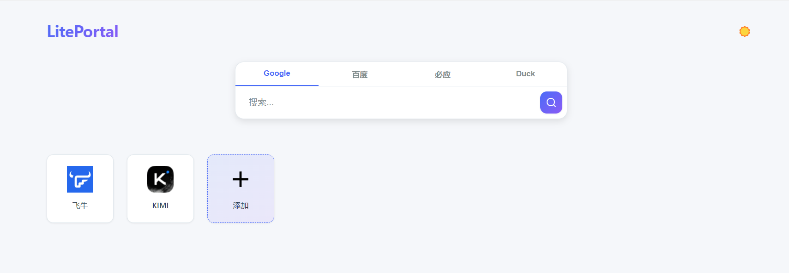
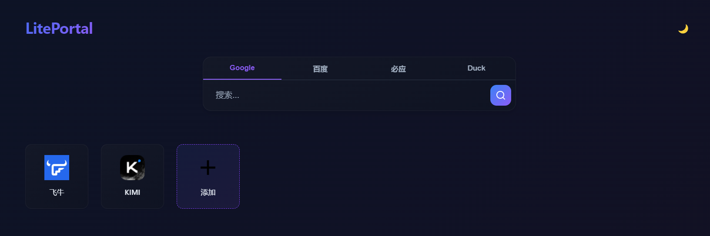
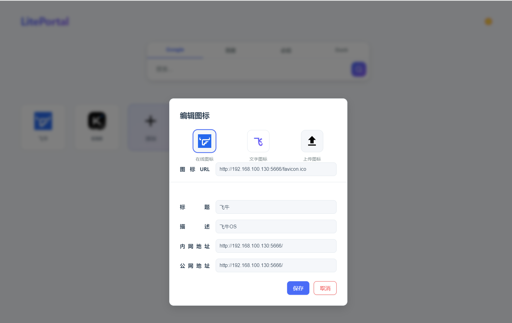

# LitePortal Nas导航门户

🛖项目地址：[LitePortal  Nas 导航门户](https://github.com/cocolight/LitePortal)


         

## 📊 一、项目简介

LitePortal是一个简洁高效的网页导航工具，支持内网和外网链接无缝自动切换。可以部署在自己的家庭局域网上，支持私有部署。








## ✨二、功能特点

- 📊简洁直观的导航界面
- 🪄内外网链接智能切换
- 🛡️数据可控，本地SQLite 数据库存储配置

## 🚀三、快速开始

#### 🕹️3.1、本地直接运行

可以下载二进制文件直接运行，二进制文件下载地址：[Github Release](https://github.com/cocolight/LitePortal/releases)

+ 想要**开机自启**，无感启动？请使用 **vbs** 脚本(`.vbs`)或者 **power shell 脚本**(`.ps1`)

1. 新建文件 `run.vbs`，内容如下：

   ```vbscript
   Set ws = CreateObject("WScript.Shell")
   ws.Run "server.exe", 0, False
   ```

   把 `run.vbs` 放到和 `server.exe` 同一目录，双击即可。

2. 设置开机自启（可选）

      把 `run.vbs` 的快捷方式放到`C:\ProgramData\Microsoft\Windows\Start Menu\Programs\StartUp` 里。

3. power shell 脚本（另一种方案）

      ```powershell
      Start-Process -FilePath 'server.exe' -WindowStyle Hidden
      ```

      

#### 📀3.2、docker 部署


参阅：[docker 部署文档](./docs/Docker部署.md)

#### 🖥️3.3、源码运行（生产模式）

- **环境要求：** Node.js >= 22.0.0

  

1. 克隆项目

   ```bash
   git clone https://github.com/cocolight/LitePortal.git
   ```

2. 构建后端项目

   ```bash
   node build.js
   ```

   构建完成后，会在项目根目录生成`./dist`文件夹。

3. 安装生产依赖

   ```bash
   cd ./dist
   pnpm install --production --shamefully-hoist
   ```

4. 运行

   ```bash
   node main.js
   ```


## 📦四、构建部署

如果想自行生成二进制文件使用，请参阅：《 [**构建部署文档**](./docs/构建部署文档.md) 》


## 📄五、许可协议

本项目基于 [GPL-3.0 license](./LICENSE) 许可。

#### 🚫 禁止商业使用
+ 对外销售、分发、云镜像收费却拒绝开源  

#### ✅ 允许的使用
+ 个人/公司**内部服务器**运行  

+ 教育、科研、开源项目贡献  

+ 自用修改，不对外发版本

  

⚠️ 一旦把软件（含修改版）给到公司外部，必须整体开源；任何专利诉讼将立即终止你的使用权。

  

**商业许可咨询**：如需商业使用，请通过 GitHub Issues 联系我们。


## 🤝 六、贡献指南

我们欢迎所有形式的贡献！请遵循以下步骤：

1. Fork 本仓库
2. 创建你的特性分支 (`git checkout -b feature/AmazingFeature`)
3. 提交你的更改 (`git commit -m 'Add some AmazingFeature'`)
4. 推送到分支 (`git push origin feature/AmazingFeature`)
5. 打开一个 Pull Request


## 📜七、更新记录

参阅： **[更新计划](./docs/开发计划.md)** 


## 🔗八、开源项目使用：

+ [Vue.js - 渐进式 JavaScript 框架 | Vue.js](https://cn.vuejs.org/)
+ [vuejs/router: 🚦 The official router for Vue.js](https://github.com/vuejs/router)
+ [vuejs/pinia: 🍍 Intuitive, type safe, light and flexible Store for Vue using the composition api with DevTools support](https://github.com/vuejs/pinia)
+ [lodash/lodash: A modern JavaScript utility library delivering modularity, performance, & extras.](https://github.com/lodash/lodash)
+ [Axios](https://axios-http.com/)
+ [Node.js — Run JavaScript Everywhere](https://nodejs.org/zh-cn)
+ [NestJS - A progressive Node.js framework](https://nestjs.com/)
+ [WiseLibs/better-sqlite3: The fastest and simplest library for SQLite3 in Node.js.](https://github.com/WiseLibs/better-sqlite3)
+ [typeorm/typeorm: ORM for TypeScript and JavaScript. Supports MySQL, PostgreSQL, MariaDB, SQLite, MS SQL Server, Oracle, SAP Hana, WebSQL databases. Works in NodeJS, Browser, Ionic, Cordova and Electron platforms.](https://github.com/typeorm/typeorm)
+ [typestack/class-transformer: Decorator-based transformation, serialization, and deserialization between objects and classes.](https://github.com/typestack/class-transformer)
+ [typestack/class-validator: Decorator-based property validation for classes.](https://github.com/typestack/class-validator)
+ [microsoft/reflect-metadata: Prototype for a Metadata Reflection API for ECMAScript](https://github.com/microsoft/reflect-metadata)
+ [ReactiveX/rxjs: A reactive programming library for JavaScript](https://github.com/reactivex/rxjs)
+ [scottie1984/swagger-ui-express: Adds middleware to your express app to serve the Swagger UI bound to your Swagger document. This acts as living documentation for your API hosted from within your app.](https://github.com/scottie1984/swagger-ui-express)
+ [expressjs/cors: Node.js CORS middleware](https://github.com/expressjs/cors)

+ [Yet Another Org - Pkg](https://github.com/yao-pkg)

