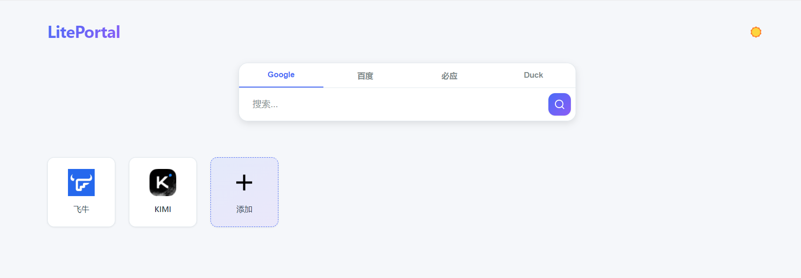
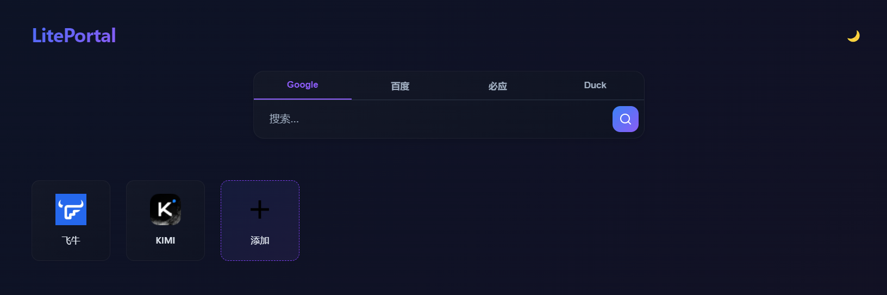
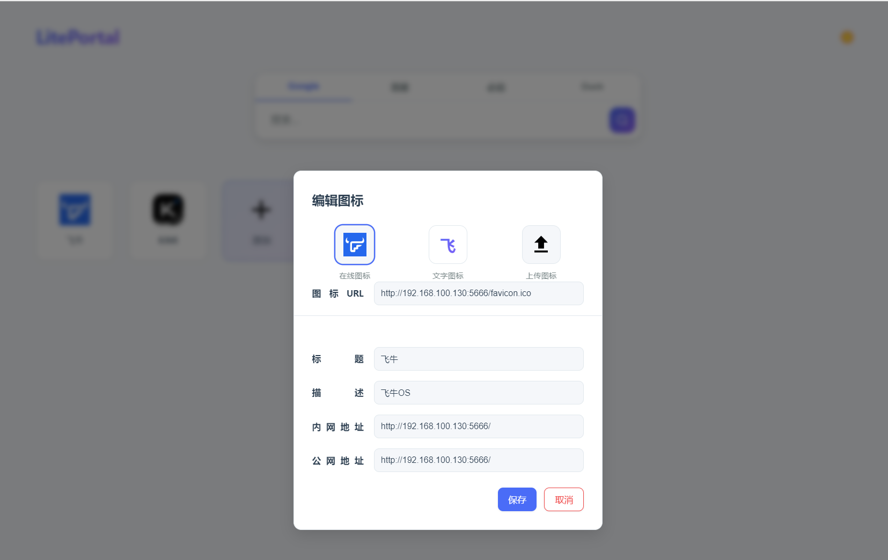

# LitePortal Nas导航门户

🛖项目地址：[LitePortal  Nas 导航门户](https://github.com/cocolight/LitePortal)


         

## 📊 一、项目简介

LitePortal是一个简洁高效的网页导航工具，支持内网和外网链接无缝自动切换。可以部署在自己的家庭局域网上，支持私有部署。








## ✨二、功能特点

- 📊简洁直观的导航界面
- 🪄内外网链接智能切换
- 🛡️数据可控，本地SQLite 数据库存储配置

## 🚀三、快速开始

#### 🕹️3.1、本地直接运行

可以下载二进制文件直接运行，二进制文件下载地址：[Github Release](https://github.com/cocolight/LitePortal/releases)

+ 想要**开机自启**，无感启动？请使用 **vbs** 脚本(`.vbs`)或者 **power shell 脚本**(`.ps1`)

1. 新建文件 `run.vbs`，内容如下：

   ```vbscript
   Set ws = CreateObject("WScript.Shell")
   ws.Run "server.exe", 0, False
   ```

   把 `run.vbs` 放到和 `server.exe` 同一目录，双击即可。

2. 设置开机自启（可选）

      把 `run.vbs` 的快捷方式放到`C:\ProgramData\Microsoft\Windows\Start Menu\Programs\StartUp` 里。

3. power shell 脚本（另一种方案）

      ```powershell
      Start-Process -FilePath 'server.exe' -WindowStyle Hidden
      ```

      

#### 📀3.2、docker 部署（推荐）


参阅：[docker 部署文档](./docs/Docker部署.md)

#### 🖥️3.3、源码运行（生产模式）

- **环境要求：** Go >= 1.22（后端编译）+ Node.js >= 22（前端构建）

1. 克隆项目

   ```bash
   git clone https://github.com/cocolight/LitePortal.git
   ```

2. 一键构建（前端 pnpm + 后端 go build → `dist/`）

   ```bash
   bash build.sh
   ```

   构建完成后，项目根目录生成 `./dist`，内含 `server`（Go 单文件二进制）、`web/`（前端产物）、`migrations/schema.sql`、`config` 用的 `.env`。

3. 运行

   ```bash
   cd dist
   ./server        # Windows: server.exe
   ```

   浏览器访问 `http://<host>:8080`。


## 📦四、构建部署

如果想自行生成二进制文件使用，请参阅：《 [**构建部署文档**](./docs/构建部署文档.md) 》


## 📄五、许可协议

本项目基于 [GPL-3.0 license](./LICENSE) 许可。

#### 🚫 禁止商业使用
+ 对外销售、分发、云镜像收费却拒绝开源  

#### ✅ 允许的使用
+ 个人/公司**内部服务器**运行  

+ 教育、科研、开源项目贡献  

+ 自用修改，不对外发版本

  

⚠️ 一旦把软件（含修改版）给到公司外部，必须整体开源；任何专利诉讼将立即终止你的使用权。

  

**商业许可咨询**：如需商业使用，请通过 GitHub Issues 联系我们。


## 🤝 六、贡献指南

完整规范见：[**CONTRIBUTING.md**](./CONTRIBUTING.md)

1. Fork 本仓库
2. 创建特性分支 (`git checkout -b feature/AmazingFeature`)
3. 提交遵循 Conventional Commits：`git commit -m 'feat: 添加某某功能'`（标题 ≤ 72 字符）
4. 本地通过全量检查（后端）：`cd backend && go vet ./... && test -z "$(gofmt -l .)" && go test ./...`
5. 推送到分支并打开 Pull Request，PR 中说明**验证方式**（跑了哪条命令、在哪个平台验证）

> 使用 AI 编码助手参与开发时，请先阅读 [**AGENTS.md**](./AGENTS.md)。


## 📜七、更新记录

参阅： **[更新计划](./docs/开发计划.md)** 


## 🔗八、开源项目使用：

**后端（Go）**

+ [gin-gonic/gin: HTTP web framework](https://github.com/gin-gonic/gin)
+ [go-gorm/gorm: The fantastic ORM library for Golang](https://github.com/go-gorm/gorm)
+ [glebarez/sqlite: Pure-Go SQLite driver（基于 modernc.org/sqlite，无 CGO）](https://github.com/glebarez/sqlite)

**前端（Vue 3 + Vite）**

+ [Vue.js - 渐进式 JavaScript 框架](https://cn.vuejs.org/)
+ [vuejs/router: The official router for Vue.js](https://github.com/vuejs/router)
+ [vuejs/pinia: Store for Vue using the composition API](https://github.com/vuejs/pinia)
+ [lodash/lodash](https://github.com/lodash/lodash)
+ [Axios](https://axios-http.com/)
+ [Node.js — Run JavaScript Everywhere](https://nodejs.org/zh-cn)

